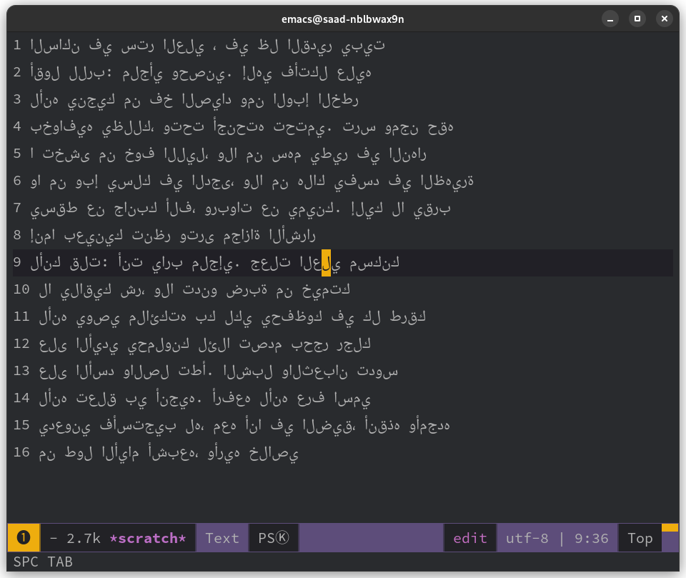

Isolated Naskh is an Arabic isolated font based on google's "Noto Naskh"

# why? 
if you are an Arabic writer, you may ask: why whould anyone use such a font?
this font is designed to be used as an LTR Arabic writing method. this eleminates the huge complexities of writing bi-directional text specially in modular text editors. or when Arabic and code are often mixed (like in markdown or html).
this is not a font to use in your webpage, but it is a font for your workbench to produce and edit bidirectional files in Arabic.
it may look unreadable at first look. but with some little practice in writing and editing, you are free forever. I it use daily as my comfy way of writing Arabic

# this how it looks on Emacs

